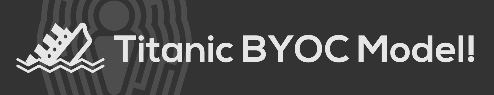

Hello there friends! In this project, we are going to go through the process start to finish of creating a model using the Titanic dataset and then later deploying it to multiple platforms. This effort is also being covered in multiple #livecoding sessions on YouTube that can be collectively found as part of [this YouTube playlist](https://youtube.com/playlist?list=PLNBQNFhVrlVSAi9jIm6K5dWhcD1L372_G).